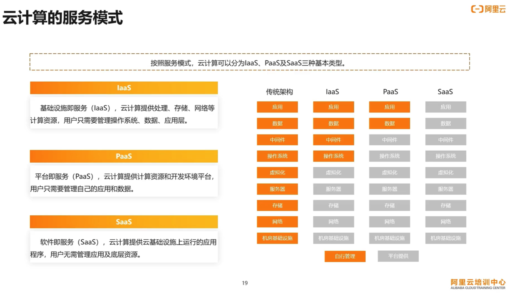

分布式系统基础知识  
    
# 资源  
> [mit6.824](https://mit-public-courses-cn-translatio.gitbook.io/mit6-824/)  
> [凤凰架构](https://icyfenix.cn/)  
    
    
# 提升性能的两种方式 —— Scaling UP and Scaling out  
> [Growing compute by scaling up and scaling out](https://developer.ibm.com/articles/scale-up-and-scale-out-vms-vs-containers/)  
    
  
scaling up 更适合小规模系统或负载相对较低的情况，而 scaling out 更适合需要高可扩展性和高可用性的大规模系统。选择哪种扩展策略取决于具体的应用场景、预期负载和资源限制等因素。有时候也可以结合两种策略，同时进行纵向和横向扩展，以获得更好的性能和扩展能力。  
  
## Scaling up（垂直扩展）  
Scaling up 是通过增加单个节点的处理能力来扩展系统的能力。这通常涉及增加服务器的硬件资源，例如增加 CPU、内存、磁盘或网络带宽等。  
    
优点：  
- 简单：相对于 scaling out，scaling up 的实施相对简单，因为只需增加单个节点的资源。  
- 较低的维护成本：由于规模较小，维护和管理单个节点相对容易。  
  
缺点：  
- 有限的可扩展性：由于 scaling up 是基于单个节点的增加资源，存在物理限制，无法无限扩展。  
- 单点故障：依赖单个节点，如果该节点发生故障，整个系统可能会受到影响。  
    
## Scaling Out（水平扩展）  
Scaling out 是通过增加系统中的节点数来扩展系统的能力。这可以是增加服务器、添加更多计算节点或分布式部署系统等。  
    
优点：  
- 高度可扩展：通过增加节点数，系统可以更好地应对负载增加，并且具有更高的横向扩展能力。  
- 高可用性：通过将负载分布到多个节点上，系统具有更高的容错能力，单个节点故障不会导致整个系统的失败。  
  
缺点：  
- 复杂性：与 scaling up 相比，scaling out 的实施可能更加复杂，涉及到节点间的通信和数据一致性等问题。  
- 高维护成本：由于存在多个节点，管理和维护分布式系统可能需要更多的工作量和复杂性。  
    
# 冗余（redundancy）和容错（tolerance）  
Redundancy and fault tolerance both refer to the ability of a system to continue operating normally even in the face of failures or faults.  
    
Redundancy refers to the use of extra or backup resources or components that provide redundancy in case of failures or downtime.  
For example, adding extra hard drives to a server as a RAID configuration or using multiple power supplies.  
Redundancy aims to prevent failure or downtime by ensuring that there are backup resources available in case of a failure.  
    
Fault tolerance, on the other hand, refers to a system's ability to continue operating normally in the event of a failure or fault in one or more components, without any disruption to the normal operation of the system.  
Fault tolerance typically involves designing a system with redundancy, load balancing, and failover mechanisms so that if one component fails or becomes unavailable, the system can continue to operate with no noticeable impact on users or applications.  
    
In summary, redundancy is the provision of extra or backup resources to prevent failure or downtime, while fault tolerance is the ability of a system to continue operating normally even in the presence of component failures or faults.  
Redundancy is a technology or approach used to achieve fault tolerance, but it is not the same thing as fault tolerance itself.  
    
    
- 冗余在于提供一些备份资源，可以在一个资源出问题时替代  
- 容错则是在出问题后能在不影响正常操作时恢复正常  
一个有容错能力的系统通常会做 redundancy，load balancing 和 failover machanisms  
- 冗余是实现容错的一种方法，但不是容错  
    
# 有状态和无状态应用  
> [stateful vs stateless](https://www.redhat.com/en/topics/cloud-native-apps/stateful-vs-stateless)  
> [Stateful vs. Stateless: Understanding the Key Differences](https://www.spiceworks.com/tech/cloud/articles/stateful-vs-stateless/)  
    
## stateful applications  
Stateful applications maintain and manage state or data about previous interactions or events.  
    
Stateful applications often rely on session management and require additional resources to handle scaling and high availability.  
    
- mysql  
    
    
## stateless applications  
Each request from a client is treated independently, without requiring the server to retain any information about the previous requests.  
    
A stateless architecture or application is a type of Internet protocol where the state of the previous transactions is neither stored nor referenced in subsequent transactions.  
    
Stateless architectures are designed to be scalable and easily distributable, as the absence of session-specific data allows requests to be handled by any available server.  
    
- CDN  
    
# session 和 cookie  
> [21 成為看起來很強的後端：什麼是 Session？](https://www.youtube.com/watch?v=DceuW3gxbNg&ab_channel=Web實驗室)  
> [22 成為看起來很強的後端：Cookie 運作方式](https://www.youtube.com/watch?v=NUGMceeFDnU&ab_channel=Web實驗室)  
> [Difference between cookies, session and tokens](https://www.youtube.com/watch?v=GhrvZ5nUWNg&t=11s&ab_channel=ValentinDespa)  
       
Session和Cookie是用于在Web应用程序中维护用户状态和会话的两种常见机制，它们有以下区别：  
       
1. 数据存储位置：  
   - Cookie：Cookie是在客户端（通常是浏览器）存储的小型文本文件。Cookie通过在浏览器中存储键值对来跟踪用户信息。  
   - Session：Session是在服务器端存储的用于跟踪用户会话信息的数据结构。每个用户会话都有一个唯一的会话标识符，该标识符通常存储在Cookie中。  
       
2. 数据存储方式：  
   - Cookie：Cookie以文本形式存储在浏览器的Cookie文件中。每次浏览器向服务器发送请求时，Cookie会通过HTTP头部带到服务器，以便服务器可以读取和处理Cookie中的信息。  
   - Session：Session数据通常存储在服务器的内存中或持久化存储（如数据库）中。服务器使用会话标识符来检索和更新与特定用户相关的会话数据。  
       
3. 安全性：  
   - Cookie：Cookie存储在客户端，因此可能存在一些安全风险。虽然可以对Cookie进行加密和签名来增加安全性，但它们仍然容易受到跨站脚本攻击（XSS）和跨站请求伪造（CSRF）等攻击。  
   - Session：Session数据存储在服务器端，相对来说更安全。会话标识符存储在Cookie中，但实际的会话数据不会暴露给客户端，减少了安全风险。  
       
4. 存储容量：  
   - Cookie：每个域名的Cookie数量和总大小都有限制（通常每个域名的Cookie数目限制在几十个，总大小限制在几KB到几MB之间）。  
   - Session：Session数据存储在服务器端，没有特定的大小限制，但服务器的可用内存和配置可能会影响存储容量。  
       
5. 跨域支持：  
   - Cookie：Cookie是与特定域名关联的，因此在跨域请求时不会自动发送Cookie。可以通过设置Cookie的"SameSite"属性和使用跨域资源共享（CORS）来控制Cookie的跨域行为。  
   - Session：由于Session数据存储在服务器端，因此对于跨域请求，会话数据可以在服务器上进行共享和访问。  
       
# session 和 tocken  
Session（会话）和Token（令牌）是在身份验证和会话管理中常见的两种机制。  
一般 session 用于 web 应用的 authentication，tocken 用于 authorization。  
Token是无状态的，可以更好地适应分布式系统和微服务架构。每个服务可以独立验证Token，而不需要共享会话状态。   
       
Session（会话）：  
- Session是一种服务器端管理会话的机制。当用户成功进行身份验证时，服务器会为该用户创建一个唯一的会话，并为其分配一个会话ID（Session ID）。  
- 会话ID通常通过Cookie发送给客户端，客户端的浏览器会在后续的请求中自动附加该Cookie，使服务器能够识别用户的会话。  
- 服务器使用会话ID来检索和关联用户的会话数据，包括用户的身份验证状态、权限和其他相关信息。会话数据通常存储在服务器的内存或数据库中。  
- 会话是有状态的，服务器需要在存储端维护会话数据，并根据会话ID管理用户的会话状态。  
       
Token（令牌）：  
- Token是一种轻量级的身份验证机制，它是由服务器签发的一段包含身份验证信息的字符串。Token可以包含用户的身份、权限、有效期等信息。  
- 服务器将Token发送给客户端，通常作为响应的一部分或存储在客户端的本地存储（如localStorage或sessionStorage）中。  
- 客户端在后续的请求中将Token作为身份验证凭证发送给服务器。  
- 服务器验证Token的有效性、完整性和签名，以确认用户的身份和权限。  
- Token是无状态的，服务器不需要在存储端维护任何会话数据，每个请求都是独立的，可以由不同的服务器进行处理。  
    
# MTBF MTTR  
Mean Time Between Failure 平均无故障时间，正常时间  
Mean Time To Restoration（ repair）平均恢复前时间，故障时间  
    
# SLA (Service level agreement)  
- 服务等级协议  
- 服务提供商和用户间定义的一种双方认可的协议，来约定服务的可用性  
- 例如定义服务保持多久在线  
    
计划外停机时间是指系统或服务在未经预先安排的维护期之外无法提供服务的时间。  
以下是常见的三个SLA可用性级别以及对应的计划外停机时间：  
    
1. 90%的可用性：计划外停机时间为36.5天（即，365天中有36.5天无法提供服务）。  
2. 99%的可用性：计划外停机时间为3.65天（即，365天中有3.65天无法提供服务）。  
3. 99.9%的可用性：计划外停机时间为8.76小时（即，365天中有8.76小时无法提供服务）。  
    
计算公式：Total downtime = (100% - Availability%) x Total time in the period  
例如：90 = (1-90%)*365 = 36.5  
    
注意，这三个级别仅供参考，实际的SLA级别和计划外停机时间将取决于具体的服务类型、应用场景和客户需求等因素。  
    
# IaaS PaaS SaaS  
- IaaS（Infrastructure as a Service）：基础设施即服务，提供了基础的计算资源（如虚拟机、存储和网络），用户可以在此基础上构建和管理自己的应用程序和环境。IaaS 提供了最高的灵活性和控制权，用户需要自己管理操作系统、中间件和应用程序。  
    
- PaaS（Platform as a Service）：平台即服务，除了提供基础设施，还提供了一个完整的应用程序开发和部署平台。PaaS 提供了在云上构建、测试、部署和扩展应用程序所需的工具和环境，用户可以专注于应用程序的开发而无需关注底层的基础设施。  
    
- SaaS（Software as a Service）：软件即服务，提供完整的应用程序作为服务。用户无需关注底层的基础设施和平台，只需通过互联网访问和使用应用程序。SaaS 提供了一种即用即享的模式，用户可以根据需要订阅和使用各种软件应用，如电子邮件服务、在线协作工具、客户关系管理系统等。  
    
这些云服务模型提供了不同层次的抽象和管理，根据用户的需求和技术能力，可以选择适合的模型来满足其业务需求。IaaS 提供了最大的灵活性和控制权，PaaS 提供了更高级别的应用程序开发和部署环境，而 SaaS 则提供了完全托管的应用程序服务，用户只需使用和订阅即可。  
    
  
    
# KaaS  
Kubernetes as a Service（KaaS）是一种云服务模型，它提供了托管的 Kubernetes 集群和相关的管理和运维功能。Kubernetes 是一个开源的容器编排平台，用于自动化部署、扩展和管理容器化应用程序。  
    
KaaS 提供了一种简化的方式来使用和管理 Kubernetes，而无需用户自己配置和管理基础设施。通过 KaaS，用户可以将应用程序容器化并部署到托管的 Kubernetes 集群中，同时享受到 Kubernetes 提供的高可用性、自动伸缩和负载均衡等功能。  
    
KaaS 提供的功能和服务可以包括以下方面：  
    
1. Kubernetes集群管理：KaaS提供了创建、配置和管理Kubernetes集群的功能。用户可以通过简单的界面或API来创建和管理集群，而无需关注底层基础设施的细节。  
    
2. 自动化部署和扩展：KaaS可以自动化应用程序的部署和扩展。用户可以定义应用程序的部署规格和伸缩策略，KaaS会自动处理相关的操作，确保应用程序按需运行。  
    
3. 监控和日志：KaaS通常提供监控和日志功能，以帮助用户实时监控集群和应用程序的状态和性能。这些功能可以帮助用户及时发现和解决问题。  
    
4. 高可用性和容错性：KaaS确保Kubernetes集群的高可用性和容错性。它可以自动处理节点故障、容器故障等情况，确保应用程序的连续可用性。  
    
5. 安全性：KaaS通常提供安全性措施，如访问控制、网络隔离等，以保护集群和应用程序的安全。  
    
通过使用KaaS，用户可以专注于应用程序的开发和业务逻辑，而无需关注底层的基础设施和Kubernetes的复杂性。KaaS提供了一种简化和托管的方式来使用Kubernetes，使用户能够更轻松地构建、部署和管理容器化应用程序。  
    
Some popular KaaS offerings include:  
1. Google Kubernetes Engine (GKE): Managed Kubernetes service provided by Google Cloud Platform.  
2. Amazon Elastic Kubernetes Service (EKS): Managed Kubernetes service provided by Amazon Web Services.  
3. Microsoft Azure Kubernetes Service (AKS): Managed Kubernetes service provided by Microsoft Azure.  
4. IBM Kubernetes Service (IKS): Managed Kubernetes service provided by IBM Cloud.  
5. DigitalOcean Kubernetes: Managed Kubernetes service provided by DigitalOcean.  
    
# 脑裂  
> [分布式系统的“脑裂”到底是个什么玩意？](https://cloud.tencent.com/developer/article/1913575)  
> [6.1 脑裂（Split Brain）](https://mit-public-courses-cn-translatio.gitbook.io/mit6-824/lecture-06-raft1/6.1-split-brain)  
    
在分布式系统中，脑裂（Split-Brain）是指系统中的节点之间由于某种通信故障或网络分区而导致彼此失去联系，无法相互通信和协调。这种情况下，原本应该是一个整体的分布式系统被分割成了多个孤立的子系统，每个子系统都认为自己是独立的，可能会独立做出决策和执行操作。  
  
脑裂问题是非常严重的，因为它会导致分布式系统的一致性和可靠性受到损害。当脑裂发生时，系统中的节点可能会出现冲突的状态和冲突的决策，这可能导致数据的不一致性、冲突的操作和服务的中断。  
  
脑裂问题通常是由于网络故障、硬件故障或软件故障引起的。例如，网络分区、网络延迟、节点崩溃或消息丢失等问题都可能导致脑裂。  
  
为了应对脑裂问题，设计和实现分布式系统时通常采用一些技术手段。其中一种常见的方法是使用一致性协议（Consensus Protocol），如Paxos或Raft，来确保节点之间的一致性和协调性。这些协议可以帮助系统在发生脑裂时进行故障检测和恢复，避免数据不一致和冲突的问题。  
  
# 分布式系统  
> [Distributed computing](https://en.wikipedia.org/wiki/Distributed_computing)  
    
分布式系统是由多个相互协作的计算机组成的计算机系统，这些计算机通过网络或其他通信媒介互相连接和通信，以协调它们的行为来提供一个统一的服务或执行一个共同的任务。  
    
分布式系统可以分为以下几类：  
1. 客户端-服务器系统：客户端发送请求，服务器响应请求并提供服务，常见的应用包括Web应用、数据库系统等。  
2. 对等式系统：对等式系统由多个节点组成，每个节点都可以提供服务并请求其他节点提供服务，常见的应用包括文件共享、P2P 网络等。  
3. 事件驱动系统：事件驱动系统由多个组件组成，每个组件都有自己的状态和事件，通过事件的触发和处理来实现系统的功能，常见的应用包括传感器网络、电力系统等。  
4. 分布式计算系统：分布式计算系统是一种将大规模的计算任务分解为小的计算子任务并分配到多个计算节点上进行计算的系统，常见的应用包括科学计算、数据分析等。  
    
分布式系统的优点包括可扩展性、可靠性和容错性等。  
但是，分布式系统在设计、实现和管理方面存在一些挑战，例如，一致性、并发性、性能和安全等问题，需要采用适当的技术和策略来解决。  
    
分布式是以缩短单个任务的执行时间来提升效率的。  
    
## 分布式系统的挑战  
> [Fallacies of distributed computing](https://en.wikipedia.org/wiki/Fallacies_of_distributed_computing)  
    
在分布式系统的设计和开发过程中，存在一些常见的计算谬误，这些谬误可能导致设计缺陷、性能问题或系统故障。  
    
1. 网络是可靠的（The Network is Reliable）：这个谬误认为网络通信是稳定的、可靠的，并且延迟为零。实际上，网络通信可能会受到延迟、丢包、分区等问题的影响，而且网络连接也可能随时中断。  
    
2. 延迟为零（Latency is Zero）：这个谬误认为在分布式系统中的通信和操作可以瞬时完成，即延迟为零。实际上，网络通信和远程操作都会引入延迟，而且延迟是无法避免的。  
    
3. 带宽是无限的（Bandwidth is Infinite）：这个谬误认为可以无限制地传输大量的数据。实际上，网络带宽是有限的资源，特别是在广域网环境下。因此，分布式系统设计应该考虑到带宽限制，并采取合适的策略来减少带宽消耗。  
    
4. 网络是安全的（The Network is Secure）：这个谬误认为网络是安全的，通信不会被窃听或篡改。实际上，网络通信可能受到各种安全威胁，如中间人攻击、数据泄露等。分布式系统应该考虑到安全性，并采取适当的加密和身份验证措施。  
    
5. 拓扑不会改变（Topology Doesn't Change）：这个谬误认为分布式系统的拓扑结构是固定不变的。实际上，分布式系统中的节点可能随时加入或离开，网络拓扑也可能动态变化。系统设计应该考虑到拓扑的动态性，并具备适应变化的能力。  
    
6. 只有一个管理员（There is One Administrator）：这个谬误认为只有一个管理员可以控制和管理整个分布式系统。实际上，分布式系统可能由多个组织或个人管理，涉及多个管理者的协调和决策。  
    
7. 传输成本为零（Transport Cost is Zero）：这个谬误认为在分布式系统中的数据传输是免费的。实际上，数据传输需要消耗网络带宽和计算资源，并且可能会产生成本。系统设计应该考虑到传输成本，并进行合理的资源管理和优化。  
    
8. 网络是同构的（The Network is Homogeneous）：这个谬误认为网络中的所有组件和连接都是相同的，没有任何差异。然而，在实际情况下，网络中的组件和连接可能具有不同的特性和性能。实际上，网络中的组件（如路由器、交换机、链路）可能具有不同的带宽、延迟、可靠性等特性。不同地理位置之间的网络连接也可能存在差异，比如跨越大陆的连接与本地局域网之间的连接会有不同的网络特性。  
    
# 集群 Cluster  
> [Computer cluster](https://en.wikipedia.org/wiki/Computer_cluster)  
> [An Overview of Cluster Computing](https://www.geeksforgeeks.org/an-overview-of-cluster-computing/)  
    
- 多个计算机组合起来形成单个系统  
- 集群中的每个节点（node）执行相同的任务，由软件控制和调度  
- 集群中的各节点通常在一个局域网（fast LANs）中  
- 通常集群中的各节点有相同的硬件和操作系统（不是一定的）  
    
集群通过提高单位时间内执行的任务数来提升效率  
    
## 集群的作用  
> [Benefits](https://en.wikipedia.org/wiki/Computer_cluster#Benefits)  
    
    
> In terms of scalability, clusters provide this in their ability to add nodes horizontally. This means that more computers may be added to the cluster, to improve its performance, redundancy and fault tolerance.  
    
- 水平扩展改善性能  
- 冗余（redundancy）  
- 容错（fault tolerance）  
    
    
## 集群的类型  
> [An Overview of Cluster Computing](https://www.geeksforgeeks.org/an-overview-of-cluster-computing/)  
    
    
### High performance (HP) clusters  
> HP clusters use computer clusters and supercomputers to solve advance computational problems.  
> They are designed to take benefit of the parallel processing power of several nodes.  
    
通常用于解决高计算能力需求的场景，并行处理需求  
    
    
### Load-balancing (LB) clusters  
> This type of distribution is generally used in a web-hosting environment.  
    
避免单个节点接受大量的任务，通常用于 web 服务，可以分担任务  
可以隐藏后端服务器IP，提高服务器安全性  
    
    
### High Availability (HA) Clusters  
高可用集群，避免单点失败 SPoF（single point of failure）  
增加冗余节点来避免失败  
    
- 无状态：  
如 web 服务  
有健康检查的负载均衡  
keepalived 解决负载均衡器的高可用  
    
- 有状态  
如 mysql，用 MHA  
redis 主从复制配置哨兵  
    
    
## HA 高可用集群实现  
    
### AIS 应用程序接口规范  
> [Application Interface Specification](https://en.wikipedia.org/wiki/Application_Interface_Specification)  
    
### VRRP 虚拟路由冗余协议  
> [什么是VRRP？](https://info.support.huawei.com/info-finder/encyclopedia/zh/VRRP.html)  
    
一种用于提高网络可靠性的容错协议，解决静态网关的单点问题  
    
### heartbeat  
Heartbeat是一个Linux系统中常用的高可用性工具，它使用类似VRRP协议的机制来保证软件或服务的高可用性。  
Heartbeat可以通过监控资源状态（如服务进程状态、虚拟IP状态等）来实现自动故障转移。  
它支持多种故障转移方式，如基于共享存储的故障转移、基于DRBD的双向数据同步故障转移等。  
    
### keepalived  
Keepalived是一个为Linux系统提供高可用性解决方案的开源软件。  
它可以监控服务器和服务的状态，并自动切换到备用服务器或备用服务，以保证系统的高可用性和可靠性。  
    
其中，Keepalived的核心是一个虚拟路由器冗余协议（Virtual Router Redundancy Protocol，VRRP）的实现，通过该协议可以在多个服务器之间共享一个虚拟IP地址，并确保虚拟IP地址总是被配置为指向当前运行正常的服务器。  
如果主服务器失效，则自动将虚拟IP切换到另外一台服务器上。  
    
除此之外，Keepalived还支持健康检查、故障转移、更改网络拓扑结构等功能，并允许用户进行高度定制化的配置和扩展。  
它常用于构建负载均衡器、Web服务器、邮件服务器等高可用性集群环境，是一项受欢迎的技术解决方案之一。  
    
    
## LB Cluster 负载均衡集群  
    
### 按实现方式分类  
    
#### 硬件  
  
> [F5 Big-IP](https://community.f5.com/t5/technical-articles/what-is-big-ip/ta-p/279398)  
    
- F5 Big-IP  
    
#### 软件  
- lvs  
- [SLB](https://developer.aliyun.com/article/1803)  
- nginx  
- haproxy  
- ats  
- perlbal  
  
#### DNS 负载均衡  
> [智能 DNS](https://github.com/lxwcd/computer-networking/blob/4b32c5e70dc54aac2483b8158eae49563378e4c7/notes/计算机网络学习笔记.md#智能-dns)  
  
通过在DNS解析中分布请求到多个服务器来平衡网络流量的技术。通过将多个服务器的IP地址配置在同一个域名下，DNS负载均衡可以实现请求的分发，从而提高系统的可用性、可伸缩性和性能。  
  
- CDN  
- GSLB  
  
### 按工作的协议层次划分  
    
#### 传输层（运输层）  
LB Cluster是一种基于协议层次划分的负载均衡集群，可以分为传输层和应用层的负载均衡集群。  
    
传输层负载均衡主要是基于传输层协议（如TCP、UDP等）实现负载均衡，通过端口和IP地址等信息将请求分发到不同的负载均衡节点。  
传输层负载均衡集群可以实现基本的负载均衡功能，如可靠性、容错性、服务质量等，但对于应用层的负载均衡功能支持相对较弱，对于某些特定的应用场景可能无法满足需求。  
    
应用层负载均衡主要是基于应用层协议（如HTTP、SMTP等）实现负载均衡，通过解析HTTP请求头、URL、Cookie等信息将请求分发到不同的负载均衡节点。  
应用层负载均衡集群可以实现更加细粒度的负载均衡和应用层面的优化，如会话保持、内容缓存、动态路由、应用防火墙等高级功能，可以满足各种复杂的应用场景。  
    
LB Cluster可以根据实际业务需求和技术特点选择不同的负载均衡方案，如基于传输层负载均衡的LB Cluster适用于简单的网络服务，如DNS、SMTP、FTP等服务；基于应用层负载均衡的LB Cluster适用于Web应用、API服务、微服务等具有复杂业务逻辑和交互模式的应用场景。  
    
常见的基于传输层的负载均衡集群包括：  
    
1. LVS（Linux Virtual Server）：基于Linux内核实现的负载均衡软件，支持四层（IP/TCP/UDP）负载均衡及基于IP隧道的三层负载均衡。  
    
2. F5 BIG-IP：商业负载均衡硬件设备和软件，支持四层和七层负载均衡，具有高可用性、高性能、可扩展性和灵活性等优势。  
    
3. Citrix ADC：商业负载均衡硬件设备和软件，支持四层和七层负载均衡，具有高可用性、灵活性、安全性和性能优势。  
    
#### 应用层  
1. Nginx：开源Web服务器和反向代理软件，支持HTTP、HTTPS、SMTP、POP3等协议的七层负载均衡和反向代理，具有高性能、高可靠性和高可扩展性等优势。  
    
2. Apache HTTP Server：开源Web服务器软件，支持HTTP、HTTPS和FTP等协议的七层负载均衡和反向代理，具有灵活性和可扩展性等优势。  
    
3. HAProxy：开源的七层负载均衡软件，支持HTTP、HTTPS、TCP和UDP等协议的负载均衡和反向代理，具有高性能、高可靠性和灵活性等优势。  
    
    
### 负载均衡的会话保持  
    
### session sticky  
同一用户调度固定的服务器  
    
- 基于Cookie  
将用户的会话ID存储到Cookie中，并设置Cookie的过期时间，使得客户端下次请求时会带上该Cookie，以便后端服务器获取会话ID，从而保持会话状态。  
    
- 基于IP地址  
将用户的IP地址作为会话ID存储到共享存储中，例如Redis、Memcached等，当后续请求到来时，负载均衡器通过IP地址识别出用户，并将请求转发到之前处理该用户请求的服务器上。  
    
- 基于URL重写  
将用户的会话ID作为URL的一部分，例如在URL后添加一些参数，或者在URL中添加特殊标记，使得请求携带会话信息，并将会话ID传递给后端服务器，以保持会话状态。  
    
### session replication  
每台服务器都有全部的 session  
    
- session multicast cluster  
    
### session server  
用专门的 session 服务器  
    
将会话信息存储在中心化服务器上的技术，具备较好的可扩展性和高可用性。  
在Session Server方案中，所有后端服务器都从共享的Session服务器上获取会话信息，  
并将处理结果写回到Session服务器上，这样就能保证多个后端服务器之间的会话信息同步和访问一致性。  
    
# 负载均衡器  
  
## LVS 和 Nginx 比较  
> [负载均衡 LVS vs Nginx 对比！还傻傻分不清？](https://www.51cto.com/article/706642.html)  
  
Nginx 优点：  
- 支持 7 层负载均衡，可以针对 http 请求的域名，目录，资源类型等做相应的分流策略  
- 网络稳定性的依赖小，这点比 LVS 有优势  
- Nginx 安装配置较简单，LVS 配置相对更复杂，如 LVS DR 模式还要修改内核参数  
- Nginx 可以进行健康检查，如果后端 RS 故障，则调度到其他后端服务器  
- Nginx 还可以做 Web 应用服务器，处理静态页面强大  
- Nginx 可以做 Web 反向加速缓存器，缓存静态页面进行加速  
- Nginx 可以做静态页面和图片服务器，丰富的第三方模块  
  
Nginx 缺点：  
- 如果做负载均衡，不需要进行 7 层处理，性能不如 LVS；因为要和客户端以及后面服务器都进行三次握手，性能差一些  
  
## Nginx 和 Haproxy  
  
# 中间件  
> [什么是中间件](https://www.ibm.com/cn-zh/topics/middleware)  
  
中间件提供了一组通用的服务和功能，用于简化、加强或协调分布式系统中不同组件之间的通信、数据传输和交互。  
  
# 微服务  
> [What are microservices?](https://microservices.io/)  
> [What is Microservices Architecture?](https://cloud.google.com/learn/what-is-microservices-architecture)  
> [Microservices Guide](https://www.martinfowler.com/microservices/)  
    
    
微服务架构是开发应用的一种架构，将大型应用分解为多个二独立的组件，每个组件负责各自的功能，处理一个用户请求时可能会需要调用多个组件共同处理  
    
现代云原生应用通常使用容器构建为微服务  
    
In short, the microservice architectural style is an approach to developing a single application as a suite of small services, each running in its own process and communicating with lightweight mechanisms, often an HTTP resource API. These services are built around business capabilities and independently deployable by fully automated deployment machinery. There is a bare minimum of centralized management of these services, which may be written in different programming languages and use different data storage technologies.  
      -- James Lewis and Martin Fowler (2014)  
    
## 微服务架构的演变  
- 单体架构  
所有功能都放在一个应用中，将应用部署到一台服务器上  
修改一个功能则需要重新打包整个应用  
对大型应用，分工合作，维护，管理等复杂  
- SOA  
service orientied architecture，多个服务组成的分布式系统  
各服务之间通过 ESB 通信，ESB（Enterprise Service Bus，企业服务总线）用于构建和管理分布式系统中服务集成和通信，其配置复杂，商业产品费用又高，且存在单点问题  
- 微服务  
微服务属于 SOA 的子集，每个服务提供独立的功能，能被独立地部署到生成环境中  
服务之间用轻量级的标准通信协议，如 http 的 RESTful API  
微服务的实现框架又多种  
    
## 微服务的优缺点  
优点：  
- 每个服务足够小，开发简单，一个服务只做一件事，独立开发团队开发  
- 松耦合  
- 不同服务可以用不同的开发语言  
- 容易领过的和第三方集成，自动部署  
- 每个微服务有自己的存储能力，可以部署独立的数据库或统一的数据库  
    
缺点：  
- 要保证不同服务之间数据的一致性，引入分布式事务和异常补偿机制  
- 适合复杂的大型系统，对小型应用拆分可能反而增加复杂性  
    
## 微服务还是单体  
> [MonolithFirst](https://martinfowler.com/bliki/MonolithFirst.html)  
    
    
单体优先：you shouldn't start a new project with microservices, even if you're sure your application will be big enough to make it worthwhile.  
    
## 微服务框架  
- Dubbo  
- Spring cloud  
